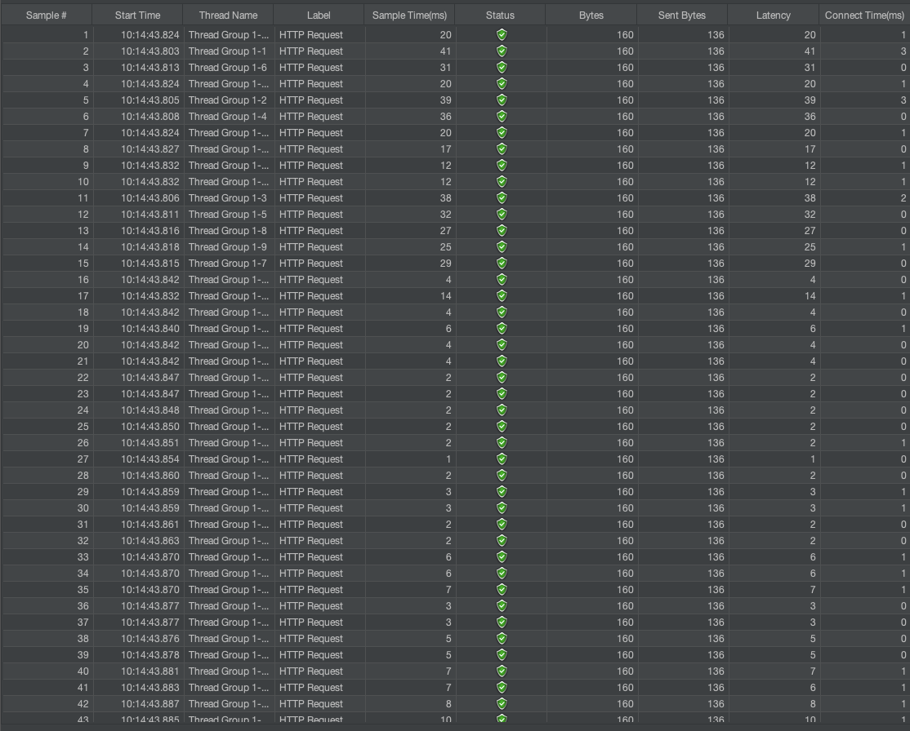
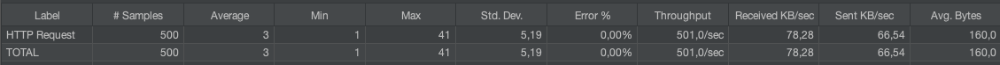

# Challenge

Implement: https://www.geeksforgeeks.org/generate-bitonic-sequence-of-length-n-from-integers-in-a-given-range/

## Solution proposal

### Using Deque - O(n) time and O(n) space

> The idea is to start with r-1, then the maximum value r at the peak, then build the sequence by strategically adding elements from the range [l, r] in a way that maintains the bitonic property, using a deque data structure to efficiently build both the increasing and decreasing portions.

### Step by step approach:

1. Check if n > (r-l)\*2+1, if true return [-1] as it's impossible.
2. Start with r-1 as it is the maximum value less than peak value r.
3. While the size of deque is less than n:
   - Add decreasing elements from r down to l at the tail of deque.
   - Add increasing elements from r-2 down to L at the head of deque.
4. Convert the deque into array.

## Do:

- [ok] Implementation
- [ok] Unit tests
- Performance Test / Benchmarks
- [ok] Proper Documentation
- [ok] Expose Solution via REST API
- [ok] Store Results into a Database (Redis with Docker Podman)

## How to install

1. Install Rust:

```
curl --proto '=https' --tlsv1.2 -sSf https://sh.rustup.rs | sh
```

2. Create projetct

```
cargo new hello-rust
```

3. Build/install dependencies

```
cargo build
```

4. Install Docker/Podman

```
brew install docker
```

5. Install Redis

```
docker run -d --name redis -p 6379:6379 redis:7-alpine
```

6. Instal k6

```
brew install k6
```

7. How to Run

1. Start Redis

```
docker start redis
```

2. Run project

```
cargo run
```

3. Run k6 test performance

```
k6 run index.js --vus 20 --duration 60s
```

## How to test

1. Get Endpoint with parameters to generate result

```
curl --location 'http://localhost:3000/bitonic?n=5&l=3&r=10' \
--header 'Content-Type: application/json'
```

2. Return all cached results

```
curl --location 'http://localhost:3000/bitonic/cache' \
--header 'Content-Type: application/json'
```

## When you need to update the libraries version

```
cargo update -p redis
```

## Clear redis cache

```
docker exec -it redis redis-cli FLUSHALL
```

## Performance Testing

Tests ran with Apache JMeter





## References

- https://rust-lang.org/pt-BR/learn/get-started/
- https://crates.io/crates/redis (Repository central)
